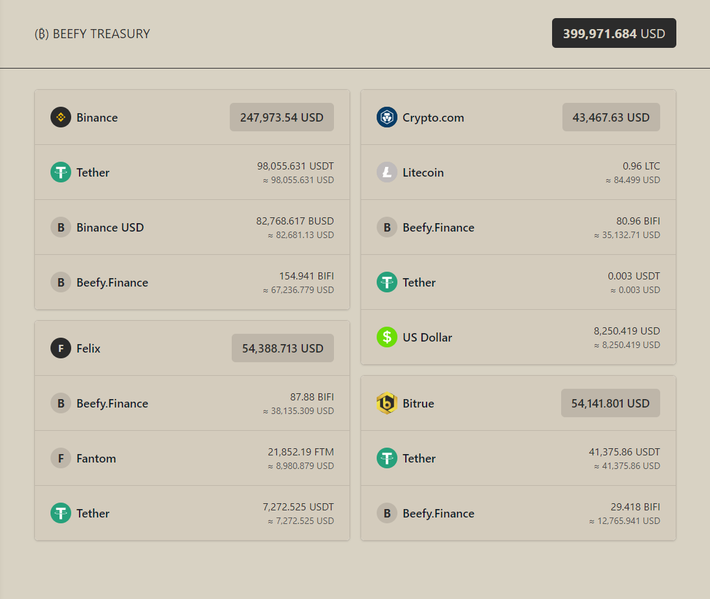

# Beefy Dao Treasury

> This website is an experimental website part of an assignement

👉 [Demo website](https://treasury.san.cx/)

## 📖 Guides

### Development

```bash
npm install

cp .env.dist .env
# then edit .env

npm run dev

# run static checking
npm run validate
```

Open [http://localhost:3000](http://localhost:3000) with your browser to see the result.

### Tips

- If venues don't have a proper name please edit `src/utilities/getVenueInformation.ts` and add the missing venues to the `venues`.
- Icons goes to `public/icons` and then needs to be linked in `src/utilities/getVenueInformation.ts`.
- If the tokens names are not displayed properly, edit `src/data/coingeckocoins.json` which is pulled from [here](https://api.coingecko.com/api/v3/coins/list). Note that some tickers are repeated so it requires some update to make it work properly. Also make sure that the array contains this entry:
- Coin icons goes to `src/assets/coins`

```json
{
  "id": "usd",
  "symbol": "USD",
  "name": "US Dollar"
}
```

## Screenshot


